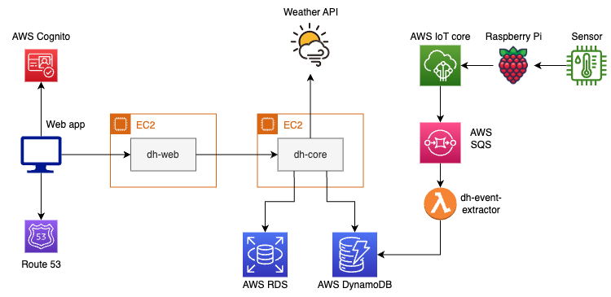

# Dihome

Dihome (digital home) is a project for home automation built on AWS.

## Architecture diagram

## Services
1. [dh-web](https://github.com/grami1/dh-web) (Web application with UI)
2. [dh-core](https://github.com/grami1/dh-core) (Core backend service)
3. [dh-event-extractor](https://github.com/grami1/dh-event-extractor) (lambda function for event extraction from SQS to DynamoDB)
4. [dh-infra](https://github.com/grami1/dh-infra) (terraform configuration)
5. [dh-sensors](https://github.com/grami1/dh-sensors) (scripts for sensors)